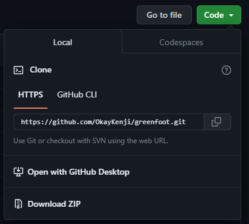

# Iona STEP Program Greenfoot Code
## Summer 2023

Code for [Iona's STEP Program](https://www.iona.edu/admissions-financial-aid/high-school-students/science-and-technology-entry-program), *exclusively for educational purposes*. 

The Iona University Science and Technology Entry Program (STEP) serves students in grades 7-12 for careers in math, science, technology, health-related fields, and licensed professions.

Our instructional curriculum will be based on the Greenfoot Textbook, "[Introduction to Programming with Greenfoot](https://www.greenfoot.org/book/)" authored by Michael Kölling. The corresponding exercise files are aligned with the contents of Version 1.0 of the textbook. However, please note that the exercises themselves have been updated to newer editions of the textbook.

# Procedure for Downloading Greenfoot:
1. Access the official [Greenfoot Website](https://www.greenfoot.org/download).
2. Follow the instructions provided by Greenfoot for the downloading process.

# Procedure for Downloading this Code
1. Locate the green "**Code**" button, positioned at the top right of the menu. Or you can [follow this link](https://github.com/OkayKenji/greenfoot/archive/refs/heads/main.zip).
2. Kindly ensure that you unzip the downloaded file in order to proceed with the subsequent steps. For detailed instructions on how to unzip a file, please refer to the support pages specific to your operating system ([Mac](https://support.apple.com/guide/mac-help/) or [Windows](https://support.microsoft.com/en-us/windows/zip-and-unzip-files-f6dde0a7-0fec-8294-e1d3-703ed85e7ebc)).

# Included Chapters:
| Chapter     | Folder | Exercises |
| ----------- | ----------- |-----------
| Chapter 1: Getting to Know Greenfoot |  [chapter01](chapter01) | *``asteroids1``*, *``leaves-and-wombats``*
| Chapter 2: The First Program: Little Crab   | [chapter02-04](chapter02-04) | *``little-crab``*
| Chapter 3: Improving the Crab - more sophisticated programming | [chapter02-04](chapter02-04) | *``little-crab-2``* *``little-crab-3``* *``little-crab-4``*
| Chapter 4: Finishing the Crab game | [chapter02-04](chapter02-04) | *``little-crab-4``* *``little-crab-5``*
| Chapter 5: Making Music: An on-screen Piano | [chapter05](chapter05) | *``piano-1``* *``piano-2``* *``piano-3``* *``piano-4``*
| Chapter 6: Interacting objects: Newton’s Lab | [chapter06](chapter06) | *``Newtons-Lab-1``* *``Newtons-Lab-2``* *``Newtons-Lab-3``*
| Chapter 7: Collision Detection: Asteroids | [chapter07](chapter07) | *``asteroids-1``* *``asteroids-2``* *``asteroids-3``*
| Interlude 2: The Greeps Competition | [interlude02](interlude02) | *``greeps``*
| Chapter 8: Creating Images and Sound | *N/A* | *N/A*
| Chapter 9: Simulations | [chapter09](chapter09) | *``ants``*  *``ants-2``*  *``ants-3``*  *``foxes-and-rabbits``*
| Chapter 10: Additional Scenario Ideas | [chapter10](chapter10) | *Various* 

The [Chapters From New Book]( ) encompass chapters and topics that were not included in the previous version (version 1.0) of the textbook.

Did you know? You can [make your own repository](https://docs.github.com/en/get-started/quickstart/hello-world). However, for the present, we will proceed with downloading the files onto a USB stick.

Text revised by [ChatGPT](https://chat.openai.com/auth/login).
